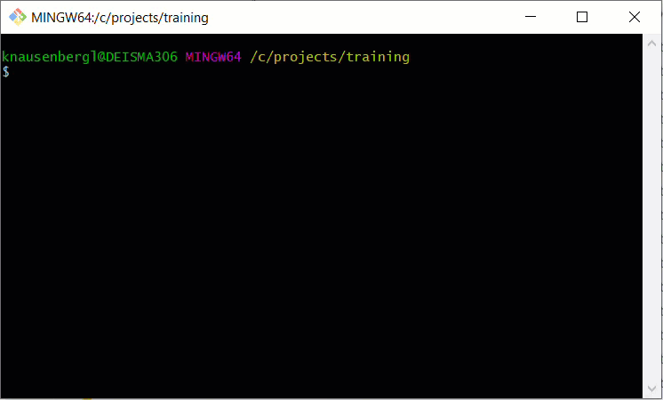
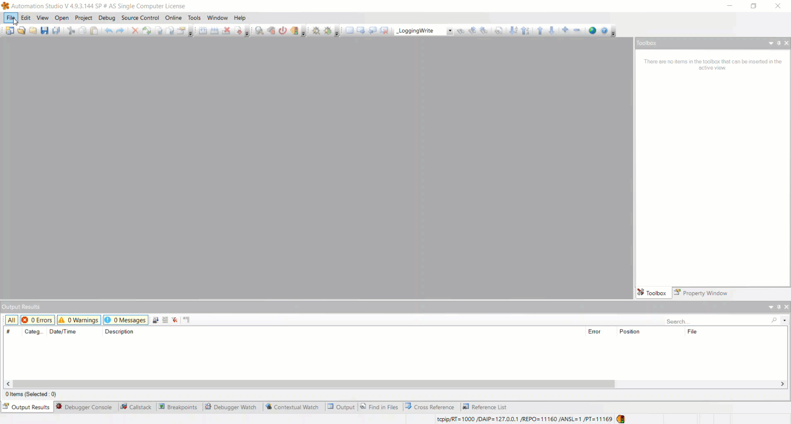
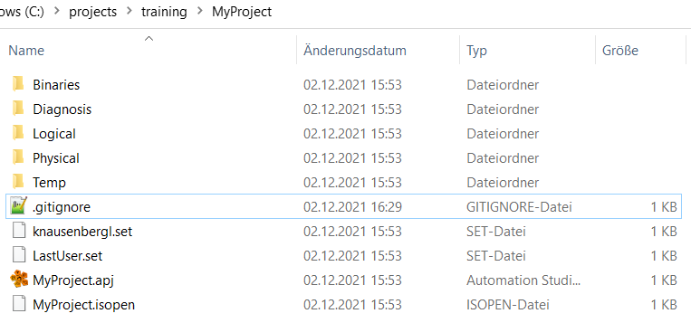
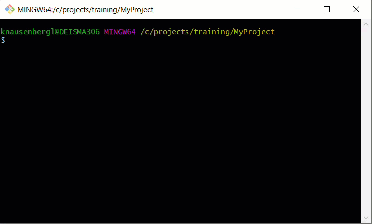
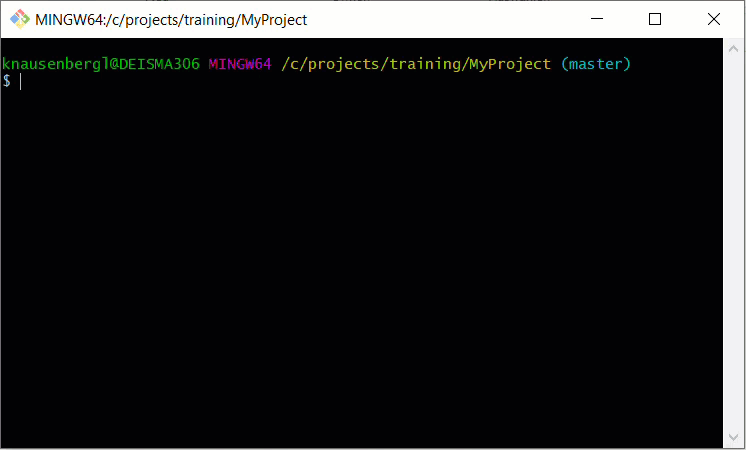

# Getting started

This guide will take you through the first steps in using Git as a version control system for a B&R Automation Studio (AS) project.

## Prerequisites

1. Download and install the most recent version of Automation Studio from the [B&R homepage](https://www.br-automation.com/)
2. Download and install the most recent version of Git from the [Git homepage](https://git-scm.com/)

In this guide, we use Git BASH to use Git from the command line. If you prefer a GUI, the Git homepage has an [overview](https://git-scm.com/download/gui/windows).

## Configure your name and email

If you haven't already entered your name and email in the Git configuration, you must do this now.

Open git bash and enter:

    git config --global user.name '<my_name>'
    git config --global user.email '<my_email@my_domain.com'

## Create a new AS project

## Add a .gitignore file

In your project directory, add a new file and rename it to ".gitignore".

This file specifies files that you do not want to put under version control, such as binary files and automatically generated files.

Open .gitignore in a text editor and enter:

    /Binaries
    /Diagnosis
    /Temp
    /*.set
    /*.isopen

## Initialize a Git repository

Open git bash in your project directory and enter:

    git init

This creates a Git repository inside your project directory.

## Stage your changes

Open git bash in your project directory and enter:

    git add .

This stages all files (except the ones in .gitignore) for your next commit.

## Commit

